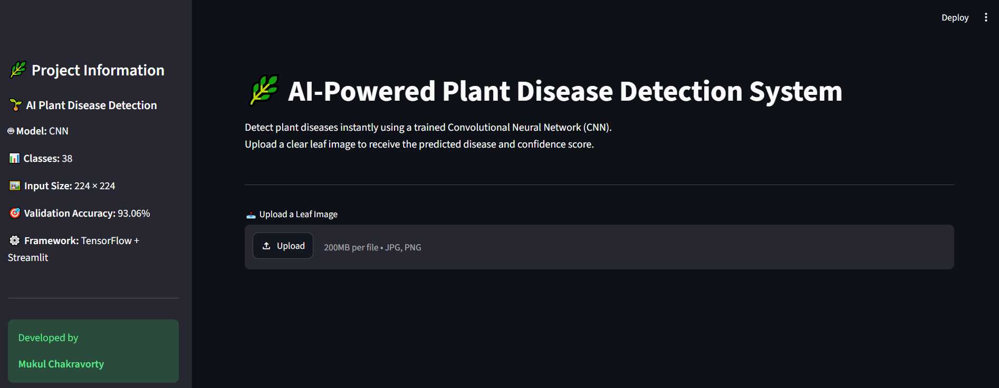
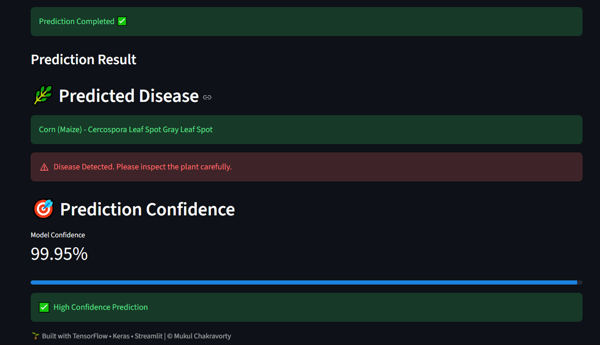

# 🌿 AI-Powered Plant Disease Detection System

<p align="center">


</p>


# 📌 Project Overview

The **AI-Powered Plant Disease Detection System** is a Deep Learning based web application that automatically identifies plant leaf diseases from uploaded leaf images.

The application uses a **Convolutional Neural Network (CNN)** trained on thousands of labeled plant leaf images across **38 different disease categories**. Users can upload an image through a Streamlit web interface and instantly receive the predicted disease along with the model confidence score.

This project demonstrates the complete Deep Learning workflow from dataset preparation to model deployment.

---


## 🌐 Live Application

The application has been successfully deployed on Streamlit Cloud and is publicly accessible.

🔗 **Live Demo:** https://ai-plant-disease-detection-system-dtkbwcfey36tl6fcfqr9tj.streamlit.app/

Upload a plant leaf image to receive:
- 🌿 Predicted Plant Disease
- 🎯 Prediction Confidence Score
- ⚡ Real-time CNN-based Inference

---

# 🎯 Project Objectives

- Detect plant diseases automatically from leaf images
- Reduce manual inspection effort
- Provide fast and reliable predictions
- Demonstrate an end-to-end Deep Learning pipeline
- Build an industry-style AI application

---

# ✨ Features

✅ Upload Plant Leaf Images

✅ Predict Disease using CNN

✅ 38 Plant Disease Classes

✅ Confidence Score

✅ Interactive Streamlit UI

✅ Deep Learning Model (.keras)

✅ Clean and Responsive Interface

---

# 🧠 Model Information

| Property | Value |
|-----------|--------|
| Model | Convolutional Neural Network (CNN) |
| Framework | TensorFlow / Keras |
| Input Size | 224 × 224 |
| Number of Classes | 38 |
| Activation | ReLU + Softmax |
| Optimizer | Adam |
| Loss Function | Sparse Categorical Crossentropy |

---

# 📊 Model Performance

| Metric | Score |
|---------|--------|
| Validation Accuracy | **93.06%** |
| Validation Loss | **0.2726** |

---

# 🌱 Supported Disease Categories

The model can classify **38 plant disease classes**, including:

- Apple Diseases
- Blueberry
- Cherry
- Corn
- Grape
- Orange
- Peach
- Pepper Bell
- Potato
- Raspberry
- Soybean
- Squash
- Strawberry
- Tomato

---

# 🛠️ Tech Stack

- Python
- TensorFlow
- Keras
- NumPy
- PIL
- Streamlit
- Google Colab
- VS Code
- Git
- GitHub

---

# 📂 Project Structure

```text
Final_Project/
│
├── app/
│   └── app.py
│
├── dataset/
│   └── raw/
│
├── models/
│   └── best_plant_disease_model.keras
│
├── notebooks/
│   └── Plant_Disease_Detection.ipynb
│
├── outputs/
│
├── requirements.txt
│
├── README.md
│
└── .gitignore
```

---

# ⚙️ Installation

Clone the repository

```bash
git clone https://github.com/yourusername/Plant-Disease-Detection.git
```

Move into project

```bash
cd Plant-Disease-Detection
```

Install dependencies

```bash
pip install -r requirements.txt
```

Run the application

```bash
streamlit run app/app.py
```

---

# 🚀 Application Workflow

```text
Leaf Image
      │
      ▼
Image Preprocessing
      │
      ▼
CNN Model
      │
      ▼
Disease Prediction
      │
      ▼
Confidence Score
      │
      ▼
Prediction Display
```

---

# 📷 Application Screenshots

### Home Page



---

### Prediction Result



---

# 📈 Future Improvements

- 🌿 Disease Treatment Recommendation
- 🤖 Generative AI Integration
- ☁️ Cloud Deployment
- 📱 Mobile Application
- 📊 Prediction History
- 🌍 Multi-language Support

---


# 👨‍💻 Author

**Mukul Chakravorty**

Aspiring Data Scientist | Machine Learning Enthusiast

GitHub:
https://github.com/MukulChakravorty

---

# 🙏 Acknowledgements

- TensorFlow
- Keras
- Streamlit
- PlantVillage Dataset

---

---

## ⭐ If you like this project, consider giving it a Star on GitHub!
